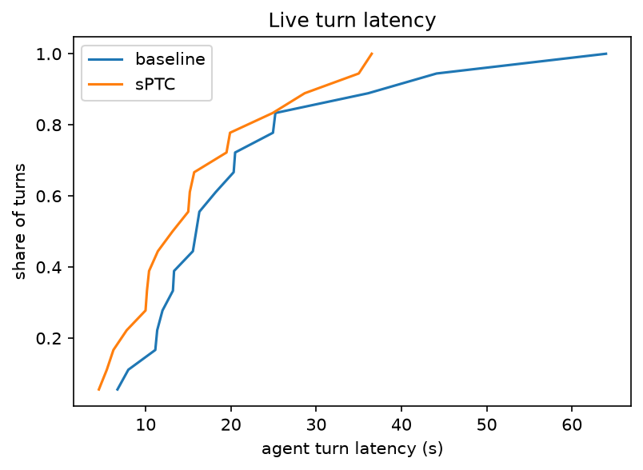

# Speculative tool calls in the wild

How much faster does a code-writing AI agent get when its tool calls start before it finishes writing the code?

This repo is a live test of an existing technique, **sPTC (Speculative Programmatic Tool Calling)** from [Alex Zhang's spec-ptc](https://alexzhang13.github.io/blog/2026/spec-ptc/), on a code-mode agent that calls real tools. The code package and CLI are called `fastlane`.

**Headline result.** On 18 tasks against live MCP servers, with real network latency, sPTC cut the agent's working time by **23%**:
- geometric-mean ratio 0.767, 95% CI [0.62, 0.97], p = 0.038
- faster on 16 of 18 tasks
- zero wasted or extra tool calls

## How it works

**The agent.** It works the way RLM agents do:
- it writes Python in **one persistent REPL per episode**, where every tool is a Python function;
- only `print` output comes back to it;
- the model is DeepSeek Flash with thinking off.

**sPTC** is a faithful port of spec-ptc:
- **Shadow:** while the model is still streaming its code, a *shadow* copy of the REPL (a deep-copied snapshot of its variables) runs each finished statement.
- **Lazy results:** tool calls in the shadow return lazy values. A real call starts immediately, and the shadow only waits when a later line actually uses the value. Independent calls, such as a loop over packages, therefore start together.
- **Only read-only tools start early.** A write call returns a placeholder, and statements that depend on it are skipped.
- **When the stream ends,** the real REPL waits for the shadow to finish, then runs the code. Real calls pick up results that are already in flight or already done.

So speculation never changes what the agent sees or does. It only changes how long it waits.

**Safety:**
- **Whitelist:** only tools on a hand-checked read-only list may start early. The servers' own `readOnlyHint` was unset on every tool.
- **Hardened REPL:** no file access, no `eval`/`exec`, pure-stdlib imports only. Tool output from public APIs is untrusted; see the Context7 CVE below.

## Result 1: real tools (MCP-Bench servers), the headline

**Setup:**
- **Tasks:** 18 tasks on 3 public, key-free MCP servers from [MCP-Bench](https://github.com/Accenture/mcp-bench): OKX market data, Steam/Epic game trends, and NixOS package search.
  - 4 MCP-Bench tasks, plus 14 synthetic tasks written to a fixed diversity table (call structure, argument source, length, intent).
  - The synthetic tasks were grounded on the live servers and audited by an independent reviewer for realism and for bias toward speculation (`tasks_v2/`).
- **Latency is real**, not injected.
- **Arms:** each task ran baseline (A) and sPTC (B) back-to-back, with the order balanced.

| | Baseline (A) | sPTC (B) |
|---|---|---|
| Mean agent time per task | 20.9 s | 16.1 s |
| p90 agent turn | 38.5 s | 30.6 s |
| Calls served by an early start | — | 298 of 440 |
| Wasted or extra calls | — | 0 (amplification 1.00) |
| Failed early starts | — | 3 of 298, all the deliberate "retired ticker" trap that the real call also hits |

**Primary endpoint** (pre-registered): geometric-mean ratio of agent time per task, B/A = **0.767**, 95% bootstrap CI [0.619, 0.967], sign-flip permutation p = 0.038.



**Where it helps.** It helps where the code makes several tool calls:

| Task | Change | B/A |
|---|---|---|
| Cross-server planning task | 64 s → 20 s | 0.31 |
| 4-hop NixOS option chain | | 0.41 |
| NixOS fan-out searches | | 0.53–0.56 |
| One price check | | 0.95–0.99 |
| One list call | | 0.95–0.99 |

There is little to hide when the code makes only one fast call.

**Where it lost.** sPTC was slower on 2 tasks, 1.72× and 2.77×. In both, the agent took a much longer path in the sPTC run (98 tool calls versus 19), which is ordinary run-to-run model variation. sPTC cannot cause it, because it never changes tool results or prompts. The confidence interval over tasks includes these runs, so the headline is conservative.

**Cost:** $0.135 of DeepSeek usage for the whole real-tools study (off-peak prices).

Full tables: `docs/results/v2/summary.md`. Design and pre-registration: `docs/specs/2026-10-01-fastlane-v2-mcp-design.md`.

## Result 2: controlled setting (tau2-bench retail, injected tool delays)

**Setup:** 12 tau2-bench retail tasks with simulated customers and tool delays of 0.5–5 s, on the same agent and sPTC harness.

| | Ratio of agent time per episode | 95% CI | p |
|---|---|---|---|
| sPTC / baseline | **0.806** | [0.73, 0.90] | 0.006 |

`docs/results/v1_tau2_faithful/`. An earlier tau2 run used a weaker harness: a fresh process per script and an approximate sPTC. Its numbers were inflated by repeated calls and are not reported.

## Appendix: a learned predictor on top of sPTC (side experiment, negative result)

**The idea.** We also tested a cheap **counting-table predictor**, with no ML and no LLM. It learns from past episodes which tool usually comes next, and where its arguments come from:
- the user's text,
- a field or list item in an earlier result,
- or a literal the agent always passes.

It then starts guesses before the model writes anything.

**Result: it does not pay on diverse real workflows.**

| Strategy (replay on identical conversations, no sPTC) | Agent time vs baseline |
|---|---|
| Counting-table predictor, best case (τ 0.05–0.1) | −1.4%, wasting 4.2 tool-seconds per second saved |
| Same predictor at the pre-registered train-tuned τ | 0%, because tuning switched it off |
| DeepSeek predicting its own next call | −5.3% |
| Starting every allowed call (brute force, 8 per step) | −8%, very wasteful |
| Perfect prediction (ceiling) | −23.6% |

**Why.** Real tools here took about 0.45 s per call, while the model spent about 3.65 s writing each step, and sPTC already overlaps the calls inside each script. What remains is the gap between steps, which depends on the model's next *decision*. A frequency table learned from a handful of diverse tasks can't anticipate that.

On tau2 retail, adding the predictor to sPTC also gave no significant gain: C/B = 0.98, p = 0.73.

**Disclosure.** The predictor's argument sources (literal constants, list items in text results, generic text patterns) and one bug fix were added after we saw it never fire in test-set replays. They are generic and τ stayed train-tuned, so the null result is not an artefact of tuning, but the sequence is stated in the spec.

## What we learned about real MCP servers

Most key-free MCP-Bench servers turned out to be unusable for latency work:

| Problem | Servers affected |
|---|---|
| **Rate limits** | Wikipedia refused 65% of anonymous requests; DexPaprika allows 30 requests per minute; the Met Museum refuses bursts; arXiv/PubMed throttle 8–32× under concurrency |
| **Serial servers** | Call for Papers, FruityVice and the stock NixOS server handle one call at a time. For NixOS we ran 4 warmed copies, like a load-balanced deployment |
| **Security** | Context7 has a prompt-injection CVE (CVE-2026-75130, CVSS 9.0), and MCP-Bench ships an affected version. An agent that executes code must treat tool output as untrusted |
| **Annotations** | No server set MCP's `readOnlyHint`, so safe-to-speculate lists had to be built by reading the code |

**Speculation and public APIs mix badly.** Early starts add concurrent requests, which is exactly what rate limits punish. The servers we kept had zero refusals at 16 concurrent calls.

## Risks and pitfalls of sPTC

### Named in the original write-up

From [Alex Zhang's blog post](https://alexzhang13.github.io/blog/2026/spec-ptc/) and [repo](https://github.com/alexzhang13/spec-ptc).

- **Only pure tools may be speculated.** A tool marked speculatable that actually has side effects would run a write before the model has finished deciding. Any input that depends on an unsafe operation (e.g. `open()`) blocks speculation.
- **Erroneous or incomplete code.** The model can stream code that errors or is never completed. Speculation must not touch real state, and calls launched for code that changes or fails are wasted.
- **Conditionals and loops.** Whether a branch is taken, or how long a loop runs, is unknown while it streams. Speculating into them can start calls the final code never makes. spec-ptc evicts such "bets" when later lines contradict them.
- **Modest and variable speedups.** The author reports roughly 1.0–1.2× on RLM workloads, and notes the gain "is highly dependent on the latency of the tools, the number of tokens generated, the load of your serving engine".
- **Backend clogging.** The worst case is a tool backend "clogged with many concurrent and potentially extra speculated requests". Speculation turns sequential traffic into bursts.
- **Overhead and scope.** The shadow needs a deep copy of the REPL namespace on every turn, values that can't be copied must be fenced off, and the implementation is specific to language and harness (Python, bash, Bun; RLM, CodeAct-style).

### Seen in our experiments

- **Rate limits and quotas.** On public APIs, speculation's concurrent requests are exactly what rate limits punish:
  - Wikipedia refused 65% of anonymous requests.
  - DexPaprika allows 30 requests per minute.
  - The Met Museum refused bursts.

  A latency win can turn into errors, blocked clients or quota bills. Check a server's limits and burst behaviour before enabling speculation.
- **Serial tool servers erase the gain.** Several MCP servers (Call for Papers, FruityVice, the stock NixOS server) handle one request at a time, so early calls just queue. sPTC needs a backend that serves concurrent requests. We used 4 warmed NixOS copies.
- **Safety labels are not trustworthy.** No MCP server we used set `readOnlyHint`, and the MCP spec treats annotations as untrusted hints anyway. A wrong "read-only" label means a write runs early. Speculation needs a verified whitelist; also check that a tool is safe to call twice, free, and does not leak private arguments.
- **Untrusted output plus code execution.** The agent, and the shadow, execute model-written code that is shaped by tool output. Context7's prompt-injection CVE shows tool output can carry instructions. The REPL and shadow must be sandboxed: we block files, `eval`/`exec` and unsafe imports.
- **Privacy ("ghost calls").** An early call reveals the user's intent to the tool provider even if its result is never used. sPTC only launches calls the model has already written, so in our runs it abandoned none. Speculating into conditionals, or adding a predictor, raises this risk.
- **Stale reads.** A result fetched early can be out of date when it is used, either because the agent writes in between or because live data moves (prices). We drop pending reads on any write. External changes are not covered.
- **The gain depends on the agent's coding style.** sPTC only helps when one script makes several calls, or when calls stream well before the stream ends. A fast model writing one call per script leaves little to overlap. Our single-call tasks saw about 0–5%.
- **Measuring it is easy to get wrong:**
  - **Run-to-run variance:** model variation between runs (one sPTC run took 98 tool calls where its baseline took 19) can swamp the effect. Use many tasks, paired runs and CIs over tasks.
  - **Replay can't stand in for live runs:** because the REPL waits for the shadow before executing, sPTC runs cannot be re-timed in replay. Its effect must be measured live.
  - **Harness artifacts inflate gains:** a non-persistent REPL caused repeated calls, which inflated the gains in our first tau2 run.

## Run

```bash
uv sync
bash scripts/install_mcp_servers.sh   # 3 MCP servers, pinned, no install scripts, OSV-checked
uv run pytest
uv run fastlane mcp-baseline          # baseline episodes (needed for replay and the structure report)
uv run fastlane mcp-calibrate         # tool latency under concurrency (no LLM)
uv run fastlane mcp-replay            # predictor appendix, free except DeepSeek self-prediction
uv run fastlane mcp-live              # A vs B on all 18 tasks
uv run fastlane mcp-report            # results_mcp/summary.md and plots
```

- **API key:** `DEEPSEEK_API_KEY` goes in `.env`.
- **Off-peak only:** live episodes refuse to start during DeepSeek's weekday peak hours, because the budget assumes off-peak prices.
- **tau2 study:** run `uv run fastlane history|record|replay|report` with `configs/base.yaml`.
